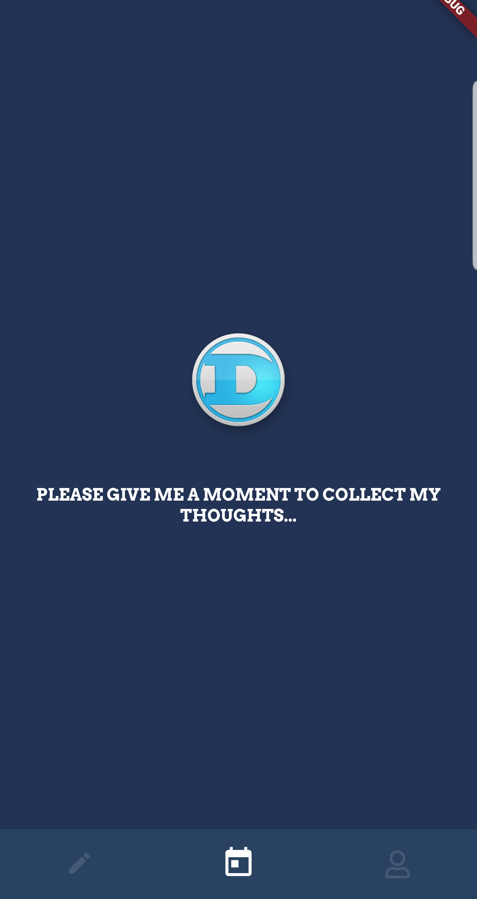

# Daily Diary

A new Flutter project.

## Building and running the Project

You need to create your own firebase project and add the config files in order to build the project
In order to build the project.After  adding firebase,  

1. `flutter pub get`  
2. `flutter run`

##Packages Used
* [shared_preferences](https://pub.dev/packages/shared_preferences)
* [avatar_glow](https://pub.dev/packages/avatar_glow)
* [font_awesome_flutter](https://pub.dev/packages/font_awesome_flutter)
* [flutter_datetime_picker](https://pub.dev/packages/flutter_datetime_picker)
* [flutter_calendar_carousel](https://pub.dev/packages/flutter_calendar_carousel)
* [intl](https://pub.dev/packages/intl)
* [charts_flutter](https://pub.dev/packages/charts_flutter)
* [flutter_launcher_icons](https://pub.dev/packages/flutter_launcher_icons)
* [flutter_local_notifications](https://pub.dev/packages/flutter_local_notifications)

**Packages for Firebase and Authentication**

* [firebase_core](https://pub.dev/packages/firebase_core)
* [firebase_analytics](https://pub.dev/packages/firebase_analytics)
* [firebase_auth](https://pub.dev/packages/firebase_auth)
* [cloud_firestore](https://pub.dev/packages/cloud_firestore)
* [google_sign_in](https://pub.dev/packages/google_sign_in)
* [flutter_facebook_login](https://pub.dev/packages/flutter_facebook_login)
* [local_auth](https://pub.dev/packages/local_auth)

## Credit

App design from **[Reflectly](https://reflectly.app/).**

## Screenshots

&nbsp;&nbsp;&nbsp;&nbsp;&nbsp;&nbsp;&nbsp;&nbsp;&nbsp;&nbsp;&nbsp;&nbsp;&nbsp;&nbsp;&nbsp;&nbsp;&nbsp;
